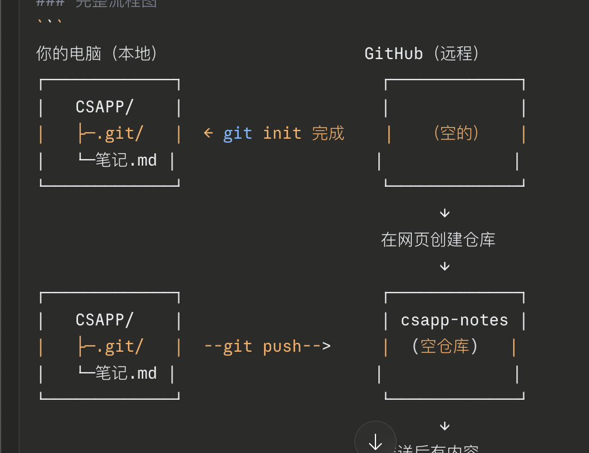
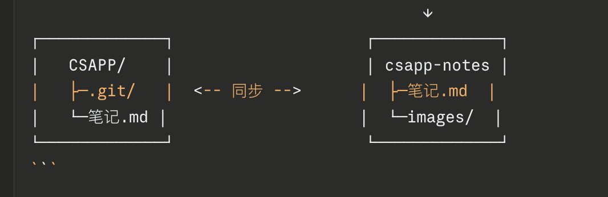
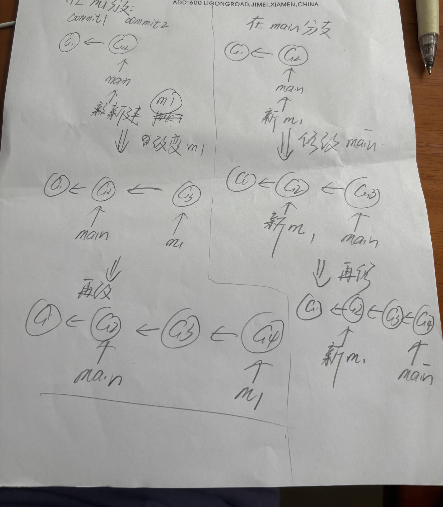
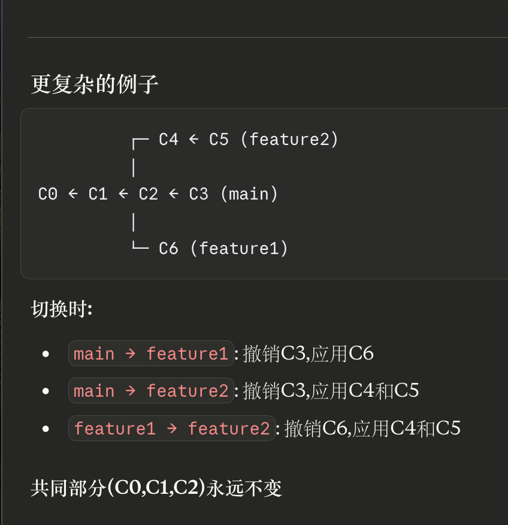

## 基础操作

**本地初始化**
bash

```bash
git init
git add .
git commit -m "Initial commit"
```





  

仓库脚本使用：

 ~/CSAPP-learning-updated.sh

  ~/Agent-learning-updated.sh

  ~/Random-notes-updated.sh


 **GitHub仓库的fork跟git分支是不一样的


## 分支管理

分支，主分支关系

**命令使用：
git branch [名字]————创建分支
git checkout [名字]————切换分支
**情况一：


**情况二：



**关键点:**
- Git的commit是**不可修改**的(immutable)
- 修改历史 = 创建新的commit链
- 主分支还指向老的C3,完全不受影响
- Feature分支现在指向新的C3'


## 远程同步

**git fetch 和 git pull区别


