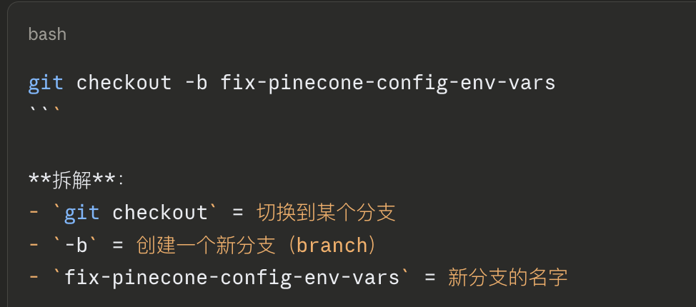
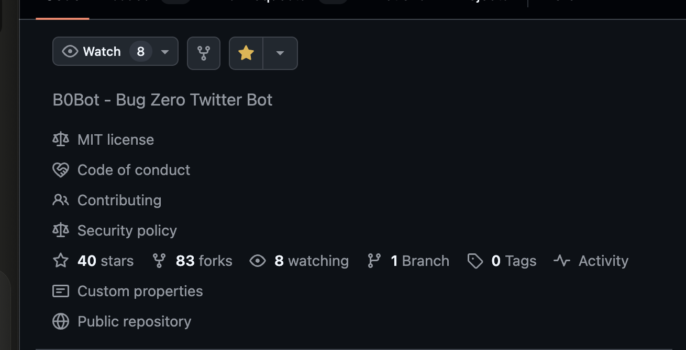

1.

新分支名字可以自己修改


2.
`git branch`
查看分支

3.
git checkout main
切换分支

4.
git push origin fix-pinecone-config-env-vars
我理解git push，但是后面orgin，表示的是将本地的代码推送到远程仓库里

5.
`cat ~/.ssh/id_ed25519.pub

6

收藏星星 和 watch之前有一个fork的按钮，这个是用来create a fork的


7
## **完整 GitHub PR 流程**

### **1. 在 GitHub 网页操作（一次性）**

- Fork 原项目到你的账号 → 得到 `你的用户名/项目名`

### **2. 在本地终端操作**

bash

```bash
# 克隆你的 fork（不是原项目！）
git clone git@github.com:你的用户名/项目名.git
cd 项目名

# 添加原项目为 upstream（用来同步更新）
git remote add upstream https://github.com/原作者/项目名.git

# 创建新分支
git checkout -b 功能分支名

# 修改代码...

# 提交
git add .
git commit -m "描述"

# Push 到你的 fork
git push -u origin 功能分支名
```

### **3. 回到 GitHub 网页创建 PR**

- Push 后，GitHub 会在你的 fork 页面顶部显示黄色提示条："Compare & pull request"
- 点击 → 填写 PR 描述 → 创建 PR


8
**查看文件内容**
bash

```bash
cat 文件名
```

**例子：**
bash

```bash
cat ~/.claude/settings.json
```
bash
创建+写入内容
```bash
cat > 文件名 << 'EOF'
内容内容内容
EOF
```